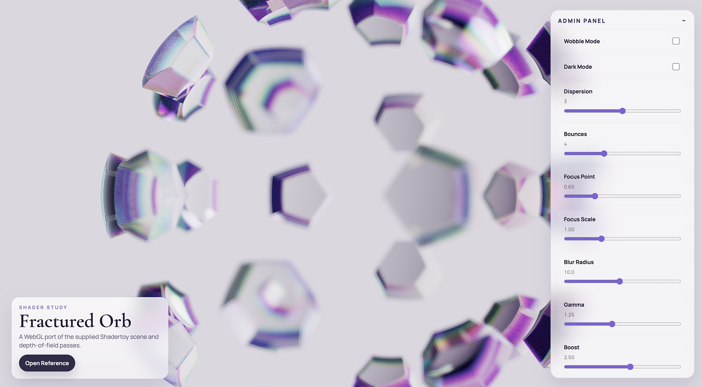

# Fractured Orb

<!-- workspace-hub:cover:start -->

<!-- workspace-hub:cover:end -->

Fractured Orb is a static WebGL2 shader study that recreates the supplied Shadertoy scene as a browser experience with a lightweight control panel.

The project renders the orb scene into an offscreen framebuffer, then runs a composite pass for depth-of-field and grading. It also exposes tuning controls for animation, dispersion, blur, focus, and color treatment.

## Demo

Reference shader: [Shadertoy - Fractured Orb](https://www.shadertoy.com/view/ttycWW)

## Features

- WebGL2 render pipeline with separate scene and composite passes
- Adjustable admin controls for wobble mode, dark mode, dispersion, bounce count, depth-of-field, and grading
- Responsive fullscreen canvas layout
- Local persistence for control values via `localStorage`
- No build step or framework dependency

## Project Structure

```text
.
├── index.html
├── main.js
├── styles.css
└── shaders
    ├── composite.frag
    ├── fullscreen.vert
    └── scene.frag
```

## Running Locally

Because the app loads shader files with `fetch()` and uses an ES module entry point, it should be served over HTTP rather than opened directly as a `file://` page.

Example:

```bash
python3 -m http.server 8080
```

Then open [http://localhost:8080](http://localhost:8080).

Any static server will work.

## Requirements

- A modern browser with WebGL2 support
- JavaScript enabled

If WebGL2 is unavailable, the app shows an error message instead of starting the shader.

## Controls

The in-page admin panel includes:

- `Wobble Mode`: switches the animation behavior
- `Dark Mode`: swaps the surrounding UI theme
- `Dispersion`: controls the shader dispersion count
- `Bounces`: controls the internal bounce limit
- `Focus Point` and `Focus Scale`: tune the depth-of-field plane
- `Blur Radius`: increases or tightens blur size
- `Gamma`, `Boost`, and `Exposure`: adjust the final composite grading
- `Speed`: scales animation playback

Use `Reset Defaults` to restore the original tuning values.

## Notes

- Settings are stored in the browser under the `fractured-orb-admin-settings` key.
- The canvas is capped to a device pixel ratio of `2` for performance.
- The render target prefers floating-point color buffers when available and falls back to `RGBA8` if needed.
